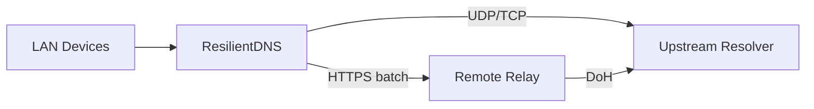

# Architecture

This page will describe:

- LAN DNS listener (UDP/TCP)
- Cache subsystem (TTL, negative caching, serve-stale)
- Upstream batching client
- Remote relay (Cloudflare Worker first)
- Observability (logs/metrics)

For now, see the project README for the high-level diagram.

## Cache

The cache is TTL-aware with negative caching and serve-stale support. This keeps
responses available during upstream failures while respecting DNS TTLs.

### Cache eviction

The cache can be bounded by `max_entries` (0 = unlimited). Eviction runs on
insert to keep the read path fast. When the cache is over capacity, fully
expired entries (past `stale_until`) are removed first, then LRU eviction
removes the oldest entries. This prevents unbounded memory growth under load.

## SWR + SingleFlight

Stale-while-revalidate serves stale entries immediately and refreshes in the
background. SingleFlight deduplicates concurrent misses and refreshes.

## Batch Refresh (Hybrid Gate)

Batch refresh is a best-effort background scheduler that keeps hot entries
fresh without blocking foreground queries. Eligibility is **hybrid**:

- `remaining_ttl_seconds <= refresh_ahead_seconds`
- `entry.hits >= refresh_popularity_threshold`

Remaining TTL is computed using monotonic time, consistent with cache expiry.
Expired or missing entries are never refreshed.

Popularity is tracked as cache-hit counts (fresh or stale-served). Hits reset
on replacement or eviction and are capped to avoid unbounded growth. An optional
recency window can be enforced via `refresh_popularity_decay_seconds`.

The scheduler ticks every `refresh_tick_ms` and enqueues up to
`refresh_batch_size` eligible keys into a bounded queue (`refresh_queue_max`).
Scanning is deterministic (stable iteration order, no jitter).

Refresh work runs in a fixed worker pool (`refresh_concurrency`) and reuses the
normal upstream resolution path (no retries, no fallback). Serve-stale triggers
also enqueue refresh requests.

## Warmup List

Warmup is a best-effort startup preload of refresh jobs from a text file.
It uses the same bounded queue and dedupe rules as regular refreshes. The file
format is simple lines of `qname qtype`, with comments (`#`) and blank lines
ignored. Warmup is capped by `refresh_warmup_limit`.

## Observability

ResilientDNS is logs-first and exposes lightweight counters. See
[Observability](observability.md) for details.

## Failure Modes

Upstream timeouts and errors are handled with serve-stale when possible, or
`SERVFAIL` otherwise. See [Failure Modes](failure-modes.md).
