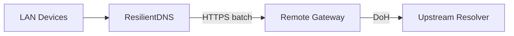

# Architecture

This page will describe:

- LAN DNS listener (UDP/TCP)
- Cache subsystem (TTL, negative caching, serve-stale)
- Upstream batching client
- Remote gateway (Cloudflare Worker first)
- Observability (logs/metrics)

For now, see the project README for the high-level diagram.

