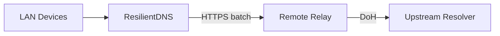

# Architecture

This page will describe:

- LAN DNS listener (UDP/TCP)
- Cache subsystem (TTL, negative caching, serve-stale)
- Upstream batching client
- Remote relay (Cloudflare Worker first)
- Observability (logs/metrics)

For now, see the project README for the high-level diagram.

## Cache

The cache is TTL-aware with negative caching and serve-stale support. This keeps
responses available during upstream failures while respecting DNS TTLs.

### Cache eviction

The cache can be bounded by `max_entries` (0 = unlimited). Eviction runs on
insert to keep the read path fast. When the cache is over capacity, fully
expired entries (past `stale_until`) are removed first, then LRU eviction
removes the oldest entries. This prevents unbounded memory growth under load.

## SWR + SingleFlight

Stale-while-revalidate serves stale entries immediately and refreshes in the
background. SingleFlight deduplicates concurrent misses and refreshes.

## Observability

ResilientDNS is logs-first and exposes lightweight counters. See
[Observability](observability.md) for details.

## Failure Modes

Upstream timeouts and errors are handled with serve-stale when possible, or
`SERVFAIL` otherwise. See [Failure Modes](failure-modes.md).
